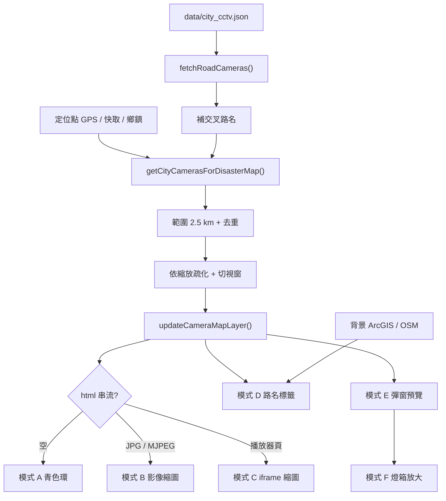

# 即時災害地圖｜路口監控程式與顯示模式

本文件說明正式站（`index.html` + `app.js` + `styles.css`）**即時災害警示地圖**上「路口監控」如何取資料、篩點、畫圖釘，以及畫面上的幾種顯示模式。

頁面不再另開市區 CCTV 清單；監控畫面只出現在災害地圖圖釘、Leaflet 彈窗，以及放大燈箱。

公開站：https://jin358-cmd.github.io/weather/

---

## 1. 資料從哪裡來

| 項目 | 位置 |
| --- | --- |
| 市區路口 CCTV 快照 | `data/city_cctv.json` |
| 來源 API | [交通部 TDX 縣市 CCTV](https://traffic.transportdata.tw/MOTC/v2/Road/Traffic/CCTV/City/{City}) |
| 載入函式 | `fetchRoadCameras()`（`app.js`） |
| 地圖圖層 | Leaflet `cameraPane`／`mapCameraLayer` |
| 圖層鍵 | `cctv`（圖例）／`cctv-points`（圖層） |

目前快照約 **2439** 支市區鏡頭（17 縣市）。國道 `data/freeway_cctv.json` **不會**畫上災害地圖。

每筆鏡頭常用欄位：

```json
{
  "id": "T000001",
  "city": "臺北市",
  "roadName": "市民大道一段",
  "crossRoad": "承德路一段",
  "stakenumber": "市民大道一段",
  "gisx": 121.5164,
  "gisy": 25.04865,
  "html": "https://hls.bote.gov.taipei/live/index.html?id=001",
  "source": "city"
}
```

- `gisx` / `gisy`：經緯度（注意是 **x=經度、y=緯度**）
- `html`：即時畫面網址（JPG／MJPEG 或播放器網頁）

載入後會先用鄰近鏡頭補交叉路名，再畫圖：

```js
cityCameraDataset = await cityResponse.json();
enrichCityCameraCrossRoadsFromNeighbors();
updateCameraMapLayer();
```

---

## 2. 地圖實際使用的範圍模式

災害地圖**只畫定位範圍內**的市區鏡頭，與圖例「定位範圍（直徑 5 公里）」同一圈。

```js
const MAP_LOCATE_DIAMETER_KM = 5;          // 直徑 5 公里
const MAP_LOCATE_RADIUS_KM = 2.5;          // 半徑
const CITY_CCTV_RADIUS_KM = MAP_LOCATE_RADIUS_KM;
const MAP_LOCATE_VIEW_DIAMETER_M = 1000;   // 定位成功後視野約 1 公里
```

定位點優先順序（`getMapLocatePoint()`）：

1. 裝置 GPS（`cctvLocateFocus`）
2. 上次定位（`localStorage` `lastMapLocateV1`）
3. 目前天氣鄉鎮中心
4. 預設臺南市／台灣中心

選點函式：

```js
function getCityCamerasForDisasterMap() {
  if (!cityCameraDataset || !Array.isArray(cityCameraDataset.cameras)) {
    return [];
  }
  const focus = getMapLocatePoint();
  if (!focus) {
    return [];
  }
  const focusPoint = { lat: focus.lat, lon: focus.lon };
  return declutterMapItems(
    dedupeCamerasByIdentity(
      cityCameraDataset.cameras
        .filter((camera) => Number.isFinite(Number(camera.gisy)) && Number.isFinite(Number(camera.gisx)))
        .map((camera) => enrichCityCameraForMap(camera, focusPoint, focus))
        .filter((camera) => isWithinMapLocateRange(Number(camera.gisy), Number(camera.gisx)))
        .sort((a, b) => a.distanceKm - b.distanceKm)
    ),
    (camera) => ({ lat: Number(camera.gisy), lon: Number(camera.gisx) })
  );
}
```

同一 `id` 或同一串流網址只留一筆（`dedupeCamerasByIdentity`）。

縮放時會再疏化，避免圖釘疊在一起（`declutterMapItems` + `getMapDeclutterSeparationKm`）：

| 地圖縮放 | 兩點最小間距 |
| --- | --- |
| ≥ 17 | 不疏化，範圍內全畫 |
| 16 | 50 m |
| 15 | 90 m |
| 14 | 150 m |
| 13 | 240 m |
| 12 | 360 m |
| 11 | 550 m |
| ＜ 11 | 850 m |

另會丟掉**目前視窗外**的點。移動／縮放地圖時 `scheduleMapLayersByView()` 會重跑 `updateCameraMapLayer()`（約 160 ms debounce）。彈窗開啟時會暫停重畫，避免畫面被刷掉。

> `CITY_CCTV_PREVIEW_LIMIT = 6`、`CITY_CCTV_NEARBY_KM = 8` 是舊清單預覽用常數。**災害地圖不套 6 筆上限**，範圍內（疏化後）都會畫。

---

## 3. 地圖顯示模式

圖釘由 `getCctvThumbIcon(camera)` 依串流網址決定外觀。判斷式是 `isLikelyDirectImageStream(url)`。

### 模式 A｜無串流：青色空心環

`html` 為空時，畫 16×16 青色環（`.cctv-map-ring`），不嵌畫面。

```js
html: `<span class="cctv-map-pin">${labelHtml}<span class="cctv-map-ring"></span></span>`
iconSize: [16, 16]
```

### 模式 B｜影像串流：即時縮圖

網址含 `mjpg` / `mjpeg` / `jpeg` / `jpg` / `bmjpg` / `getjpeg` / `snapshot` 時，圖釘是 **80×60** 的 ``（青框 `#0096c7`）。

### 模式 C｜播放器頁：iframe 縮小預覽

網址是 `index.html`、`/play/`、`.html`、`showframe`、`showcctv`、`hls.`、`/live/` 等播放器頁時，圖釘內嵌 `<iframe>`。實際 iframe 是 320×240，再用 `transform: scale(0.25)` 縮成 80×60，避免小框載入整頁排版。圖釘上的 iframe **不能點**（`pointer-events: none`），點擊仍交給 Leaflet marker。

```js
function isLikelyDirectImageStream(url = "") {
  const lower = String(url).toLowerCase();
  if (!lower) return false;
  if (lower.includes("index.html") || lower.includes("/play/") || lower.includes(".html")) {
    return false;
  }
  if (lower.includes("mjpg") || lower.includes("mjpeg") || lower.includes("jpeg") || lower.includes("jpg")) {
    return true;
  }
  if (lower.includes("bmjpg") || lower.includes("getjpeg") || lower.includes("snapshot")) {
    return true;
  }
  if (
    lower.includes("showframe") ||
    lower.includes("showcctv") ||
    lower.includes("hls.") ||
    lower.includes("/live/")
  ) {
    return false;
  }
  return true;
}
```

目前快照粗分：播放器頁約 1415、影像串流約 81、其餘（多半當影像處理）約 943。

### 模式 D｜路名標籤（疊在圖釘下方）

| 標籤 | 條件 | DOM |
| --- | --- | --- |
| 雙路交叉 | 解出兩條路名 | `.cctv-map-road-label-int` 兩行 |
| 單路 | 只有一條可用路名 | `.cctv-map-road-label` 一行 |
| 不顯示 | 只有「路口」「交叉路名待補」「交叉路名查詢中…」 | 無標籤 |

路名來源（由近到遠）：

1. 資料欄 `roadName` / `crossRoad` / `stakenumber` / `description`（可切「與」「／」）
2. 100 m 內鄰居鏡頭補交叉路（`enrichCityCameraCrossRoadsFromNeighbors`）
3. 背景反查（佇列間隔約 280 ms）
   - ArcGIS `StreetInt`（55 m 內視為路口）
   - ArcGIS `PointAddress` / `StreetAddress`（80 m）
   - 附近路名 → 交叉
   - OSM Nominatim
   - ArcGIS `StreetName`
4. 結果快取在 `localStorage` `cctv-place-label-cache-v3`
5. 臺南市、緯度 &lt; 23.016（鹽水溪以南）的「台17線」顯示為 **中華西路**

反查完成後 `refreshCctvMarkerPlace()` 只換標籤與彈窗文字，不重設地圖視野。

### 模式 E｜點圖釘：彈窗預覽

```js
function buildCctvMapPopupHtml(camera) {
  // 路名（一或兩行，金色 #ffb020）
  // 預覽（影像或 iframe）
  // 「點擊放大監控」
}
```

彈窗 class：`cctv-popup-wrap disaster-map-popup`。開啟後約 60 秒內暫停圖層重畫（`holdMapPopupRefresh`）。

### 模式 F｜放大燈箱

點彈窗預覽 → `openCctvMonitorLightbox(camera)`。

- 全畫面遮罩 `#cctvMonitorLightbox`
- 標題為路口短名
- 關閉鈕在面板**左下**
- 點遮罩或 Esc 也可關
- 開啟時鎖頁面捲動

---

## 4. 圖層與圖例怎麼對

| 項目 | 行為 |
| --- | --- |
| Leaflet pane | `cameraPane`，z-index **740**（壓在避難場所 670、定位圈 680 之上） |
| 圖例列 | 固定列：避難場所 → 路口監控 → 定位範圍 |
| 地圖左上 chips | 同樣順序；有點位才出現「路口監控 N」 |
| 預設 | 圖層開啟 |
| 開關 | 路口監控可用圖例開關關掉；定位範圍鎖定不能關 |
| 點圖例／chip | `focusMapLegendMarkers("cctv")` 對準這批圖釘 |

樣式重點（`styles.css`）：

- 圖釘框 `#0096c7`，無串流環 `#00d4ff`
- 路名黑底青框，不擋點擊（`pointer-events: none`）
- `cameraPane` `overflow: visible`，縮圖與路名可超出圖磚

---

## 5. 資料流



---

## 6. 畫點主程式

`updateCameraMapLayer()` 會重用既有 marker（只在串流網址變更時換 icon），避免縮放時整層重掛：

```js
function updateCameraMapLayer() {
  if (!warningMap) return;
  if (!mapCameraLayer) mapCameraLayer = L.layerGroup();

  const camerasToPlot = getCityCamerasForDisasterMap();
  const keepKeys = new Set(camerasToPlot.map((c) => getCameraMarkerKey(c)).filter(Boolean));
  // 不在範圍內的舊點刪除
  // 既有點：setLatLng、必要時 setIcon
  // 新點：
  marker = L.marker([lat, lon], {
    pane: "cameraPane",
    icon: getCctvThumbIcon(camera),
    title: formatCameraIntersectionShort(camera),
    zIndexOffset: 400
  });
  marker.bindPopup(buildCctvMapPopupHtml(camera), getMapPopupOptions({
    className: "cctv-popup-wrap disaster-map-popup"
  }));
  scheduleCameraMapPlaceEnrichment(camera);
}
```

圖釘 HTML 組裝：

```js
function getCctvThumbIcon(camera) {
  const streamUrl = String(camera?.html || "").trim();
  const labelHtml = getCctvMapRoadLabelHtml(camera);
  if (!streamUrl) {
    return L.divIcon({
      className: "cctv-map-thumb-marker",
      html: `<span class="cctv-map-pin">${labelHtml}<span class="cctv-map-ring"></span></span>`,
      iconSize: [16, 16],
      iconAnchor: [8, 8]
    });
  }
  const useImage = isLikelyDirectImageStream(streamUrl);
  const mediaClass = useImage ? "cctv-map-thumb-media" : "cctv-map-thumb-media cctv-map-thumb-frame";
  const thumbClass = useImage ? "cctv-map-thumb" : "cctv-map-thumb cctv-map-thumb--frame";
  return L.divIcon({
    className: "cctv-map-thumb-marker",
    html: `<span class="cctv-map-pin">${labelHtml}<span class="${thumbClass}">${getCameraPreviewHtml(camera, mediaClass)}</span></span>`,
    iconSize: [80, 60],
    iconAnchor: [40, 30]
  });
}
```

預覽媒體：

```js
function getCameraPreviewHtml(camera, className = "cctv-map-popup-media") {
  const streamUrl = String(camera?.html || "").trim();
  if (!streamUrl) {
    return `<span class="cctv-map-thumb-fallback">路口</span>`;
  }
  const useImage = isLikelyDirectImageStream(streamUrl);
  return useImage
    ? ``
    : `<iframe class="${className} cctv-map-popup-frame" src="${safeUrl}" title="${alt}" loading="lazy"></iframe>`;
}
```

---

## 7. 相關檔案與函式

| 檔案 | 用途 |
| --- | --- |
| `app.js` | 載入、篩點、圖釘、彈窗、燈箱、路名反查 |
| `styles.css` | `.cctv-map-*`、`.cctv-monitor-lightbox*` |
| `index.html` | `#warningMap`、圖例「路口監控」、`#cctvMonitorLightbox` |
| `data/city_cctv.json` | 市區鏡頭快照 |

| 函式 | 作用 |
| --- | --- |
| `fetchRoadCameras` | 讀 JSON、補交叉路、第一次畫圖 |
| `getMapLocatePoint` | 定位中心 |
| `isWithinMapLocateRange` | 是否在 2.5 km 半徑內 |
| `getCityCamerasForDisasterMap` | 地圖要用的鏡頭清單 |
| `declutterMapItems` | 依縮放／視窗疏化 |
| `isLikelyDirectImageStream` | 影像 vs 播放器 |
| `getCctvThumbIcon` | 圖釘模式 A/B/C + 路名 |
| `updateCameraMapLayer` | 增刪改 Leaflet markers |
| `buildCctvMapPopupHtml` | 彈窗 |
| `openCctvMonitorLightbox` | 放大 |
| `lookupCameraPlaceFromLiveMaps` | 路名反查 |
| `aliasProvincialRoadName` | 臺南台17線 → 中華西路 |

---

## 8. 與舊清單程式的差別

`app.js` 仍留有縣市／關鍵字清單函式（`scoreCityCameras`、`renderCityCameraList` 等），但 `index.html` 已拿掉清單 UI。

| | 舊清單（程式還在、頁面已關） | 災害地圖（現行） |
| --- | --- | --- |
| 範圍 | 縣市、鄉鎮、關鍵字、全台、或定位圈 | **只有定位圈 5 km 直徑** |
| 數量 | 預覽 6 筆，其餘摺疊 | 範圍內疏化後全畫 |
| 畫面 | 卡片列表 | 地圖縮圖／環／彈窗／燈箱 |
| 國道 | 曾有高速公路清單 | **不畫在災害地圖** |

改地圖顯示時，請改 `getCityCamerasForDisasterMap`、`getCctvThumbIcon`、`updateCameraMapLayer` 與 `.cctv-map-*`，不要只改清單函式。
